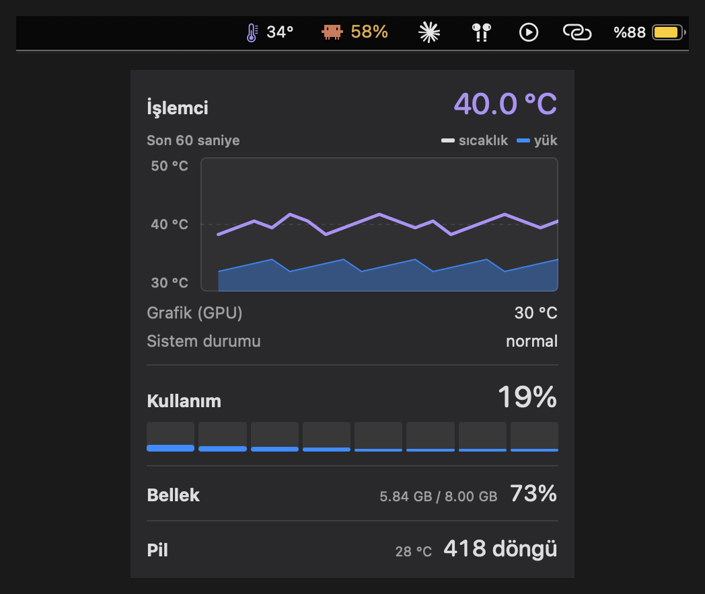

# macstats

macOS menü barında işlemci sıcaklığı gösteren küçük bir uygulama. Tıklayınca
son 60 saniyenin grafiği, işlemci kullanımı, bellek ve pil bilgisi açılıyor.

Apple ile ilgisi yoktur, Apple tarafından desteklenmez.



## Gereksinimler

- macOS 13 veya üstü
- Apple Silicon (Intel için yazılmış bir yedek yol var ama **test edilmedi**)
- Xcode komut satırı araçları

## Derleme

```bash
swift build && swift test     # 24 test, hepsi saf mantık
./build-app.sh                # çift tıklanabilir macstats.app üretir
open macstats.app
```

`swift run` ile de çalışır ama "Girişte başlat" ve uygulama simgesi yalnızca
gerçek bir `.app` paketi içinde işler; onları denemek için `build-app.sh`
kullan.

Yardımcı iki araç:

```bash
swift run macstats-cli 5      # terminalde canlı ölçüm, tam kırılımla
swift run sensor-probe        # bu Mac'teki bütün sıcaklık sensörlerini döker
```

## Veriler nereden geliyor

| Ölçüm | Kaynak | Durum |
|---|---|---|
| İşlemci / GPU / pil sıcaklığı | IOKit içindeki `IOHIDEventSystemClient` | **Belgelenmemiş** |
| İşlemci kullanımı | `host_processor_info` | Resmî API |
| Bellek | `host_statistics64`, `vm.swapusage` | Resmî API |
| Pil döngüsü | IORegistry / `AppleSmartBattery` | Resmî API |
| Termal durum | `ProcessInfo.thermalState` | Resmî API |

Sıcaklık dışındaki her şey Apple'ın belgelediği arayüzlerle okunuyor.

**Sıcaklık ise belgelenmemiş bir yoldan geliyor.** Apple, Apple Silicon
Mac'lerde sıcaklık sensörlerini uygulamalara resmî olarak açmıyor. Kök yetkisi
gerekmiyor, ek izin istenmiyor; ama Apple bir gün bunu değiştirirse sıcaklık
okunamaz hâle gelebilir. Bu yüzden o kod tek bir dosyada (`Sicaklik.swift`)
ayrı tutuluyor: bozulursa uygulama çökmez, sıcaklık yerine "—" gösterip
çalışmaya devam eder. Aynı sebeple App Store'a giremez.

## Bilinen sınırlar

- **Sadece MacBook Air (M1, 2020) üzerinde denendi.** Sensör isimleri çipten
  çipe değişiyor. Başka bir modelde sıcaklık "—" görünürse `sensor-probe`
  çıktısı sorunu göstermeye yeter.
- **Intel desteği hâlâ gerçek donanımda çalıştırılmadı.** `SicaklikSMC.swift`
  yalnızca IOHID hiçbir şey döndürmediğinde devreye giriyor. Kullandığı üç
  SMC anahtarı ([jkuri/macstats](https://github.com/jkuri/macstats) ile
  çapraz doğrulandı — 2015'ten beri gerçek Intel Mac'lerde çalışan bağımsız
  bir projede birebir aynılar), ama SMC çağrı protokolünün kendisi bir Intel
  Mac'te hiç denenmedi.
- **Uygulama imzasız.** Kendi makinende sorunsuz açılır. Başka birine
  verirsen macOS "geliştirici doğrulanamadı" diyecek; Sistem Ayarları →
  Gizlilik ve Güvenlik → "Yine de Aç" gerekir.
- Kod yorumları şimdilik Türkçe.

## Tasarım kararları

Kodda anlaşılmayabilecek yerlerin çoğu yorumlarla açıklandı. Öne çıkanlar:

- **İşlemci sıcaklığı = çekirdek sensörlerinin en yükseği.** Bu Mac'te 57
  sıcaklık sensörü var; bazıları sıcaklık bile değil (`PMU tcal` sabit bir
  kalibrasyon referansı), bazıları bağlı olmayan soketlerden −22 °C okuyor.
  Hepsinin en yükseğini almak, makine buz gibiyken de sabit 51.9 °C
  göstermek anlamına gelirdi.
- **Okunamayan değer için sayı gösterilmiyor**, "—" gösteriliyor. Yanlış bir
  sıcaklık, sıcaklık olmamasından beterdir.
- **Bellek baskısı göstergesi kaldırıldı.** Okuduğumuz sysctl bu makinede
  sürekli "uyarı" derken macOS'un kendi aracı belleğin %42'sinin boş olduğunu
  söylüyordu; doğrulayamadığımız bir sayıyı uyarı diye göstermedik.
- **Menü bar simgesinin rengi** kızılötesi ısı haritası (mor → fuşya →
  kehribar), trafik ışığı değil: ısınan bir işlemci arıza değil, çalışıyor
  demek.
- **Ölçüm ana iş parçacığında yapılmıyor** ve yalnızca ekranda gösterilen
  sensörler okunuyor — bir ölçüm 55 ms'ten 3.3 ms'e indi.

## Teşekkür

Intel SMC anahtarları [jkuri/macstats](https://github.com/jkuri/macstats)
ile çapraz doğrulandı — 2015'ten beri geliştirilen, bağımsız bir proje.

## Lisans

[MIT](LICENSE)
